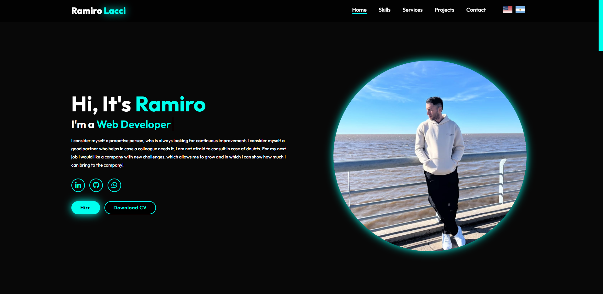
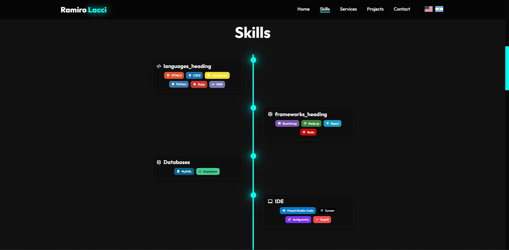
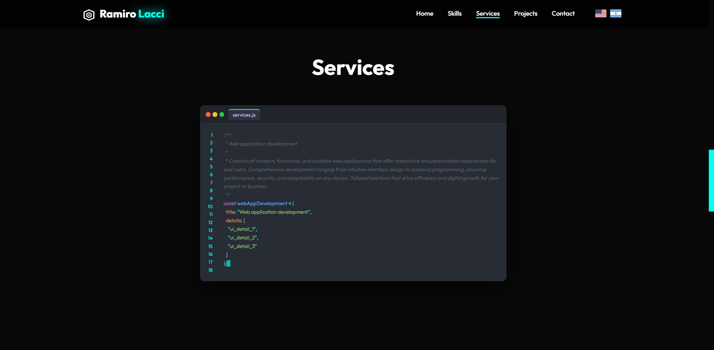
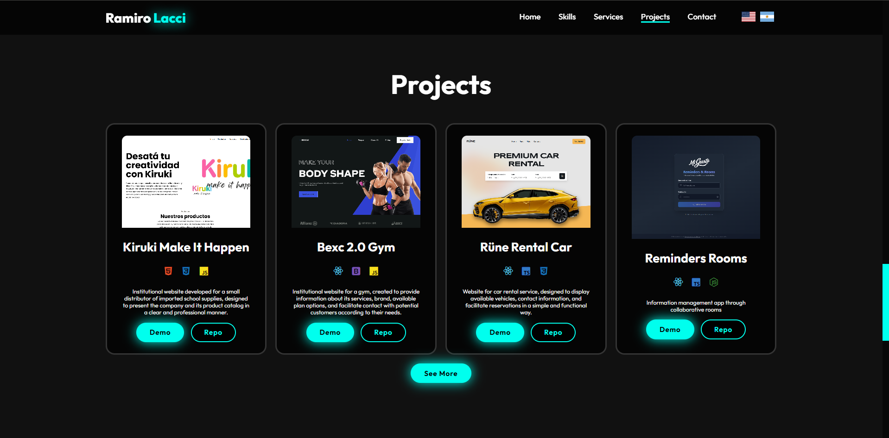
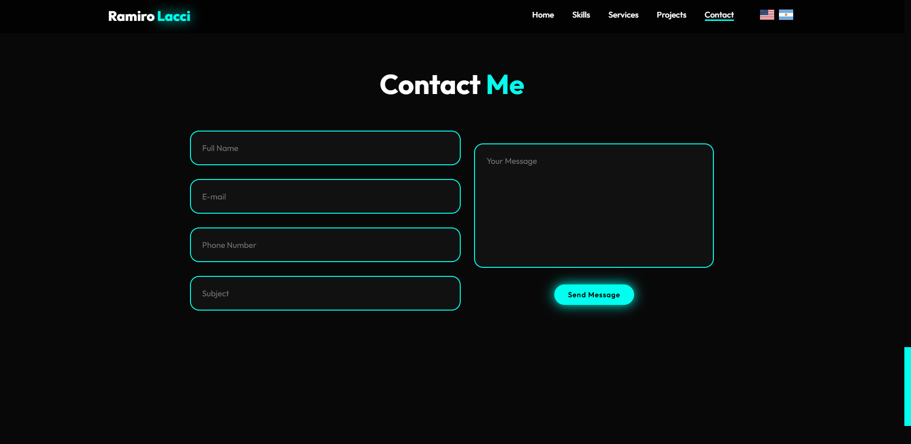

<div align="center">
  <h1>🚀 Ramiro Lacci | Web Portfolio</h1>
  <p><strong>A modern, high-performance, and visually stunning web architecture showcase.</strong></p>

  <p>
    
    
    
    
    
  </p>
</div>

---

## 🖼️ Project Showcase

<div align="center">
  
  <br>
  
  <br>
  
  <br>
  
  <br>
  
</div>

---


## ✨ Overview

This project is a high-end personal portfolio designed to highlight technical expertise and creative design. Built with **React 19** and **TypeScript**, it features a smooth user experience powered by **GSAP** animations and a dual-language system.

### 🌟 Key Features

- **🌑 Premium Dark Aesthetic**: A sleek, modern design with glassmorphism effects and curated color palettes.
- **🔡 Bi-lingual Support**: Seamlessly switch between **English** and **Spanish** using `react-i18next`.
- **🎬 Professional Animations**: Fluid entrance and scroll-triggered animations using `GSAP` and `ScrollTrigger`.
- **💻 Code Simulation**: An interactive "Services" section that simulates a real-time code editor typing experience.
- **📱 Ultra Responsive**: Optimized for all devices, from desktop monitors to mobile phones.
- **🎨 Custom Design System**: Built with vanilla CSS for maximum performance and unique styling control.

---

## 🛠️ Tech Stack

- **Core**: [React 19](https://reactjs.org/), [TypeScript](https://www.typescriptlang.org/)
- **Build Tool**: [Vite](https://vitejs.dev/)
- **Animations**: [GSAP](https://greensock.com/gsap/) & [ScrollTrigger](https://greensock.com/scrolltrigger/)
- **Translation**: [i18next](https://www.i18next.com/)
- **Icons**: [Lucide React](https://lucide.dev/)
- **Typing FX**: [Typed.js](https://mattboldt.github.io/typed.js/)

---

## 📂 Project Structure

```text
src/
├── assets/             # Images and SVG icons
├── components/         # Reusable React components
│   ├── CodeEditorSimulator.tsx
│   ├── Hero.tsx
│   ├── Navbar.tsx
│   └── ...
├── translations/       # i18n JSON files (EN/ES)
├── index.css           # Global styles and design system
└── main.tsx            # Application entry point
```

---

## 🚀 Getting Started

Follow these steps to run the project locally:

1. **Clone the repository**
   ```bash
   git clone https://github.com/ramirolacci/Portfolio.git
   ```

2. **Install dependencies**
   ```bash
   npm install
   ```

3. **Run in development mode**
   ```bash
   npm run dev
   ```

4. **Build for production**
   ```bash
   npm run build
   ```

---

## 📬 Contact & Socials

- **LinkedIn**: [Ramiro Lacci](https://www.linkedin.com/)
- **Portfolio**: [Live Demo](https://ramirolacci.com)
- **Work with me**: Feel free to reach out via the contact form in the app!

<p align="center">
  Developed with ❤️ by <strong>Ramiro Lacci</strong>
</p>

