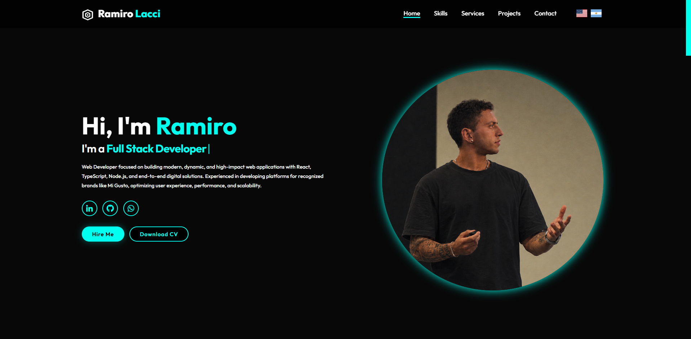
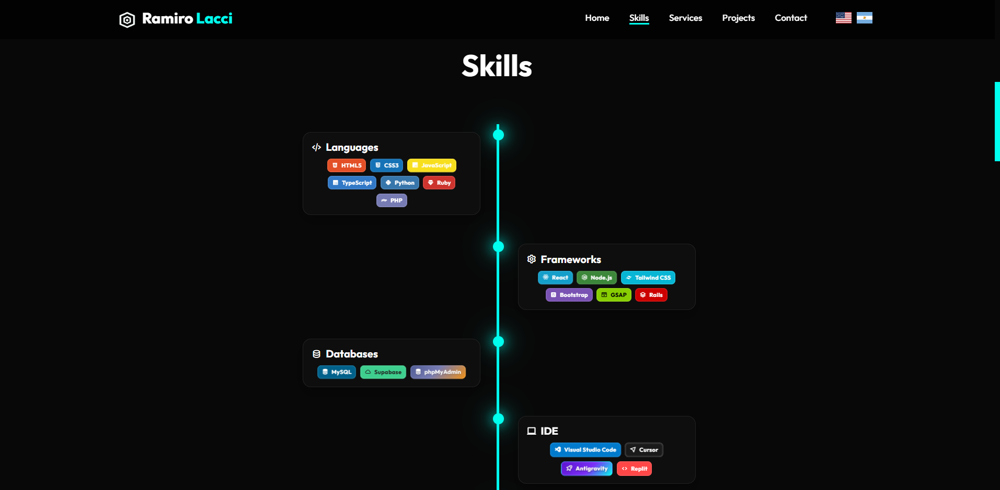
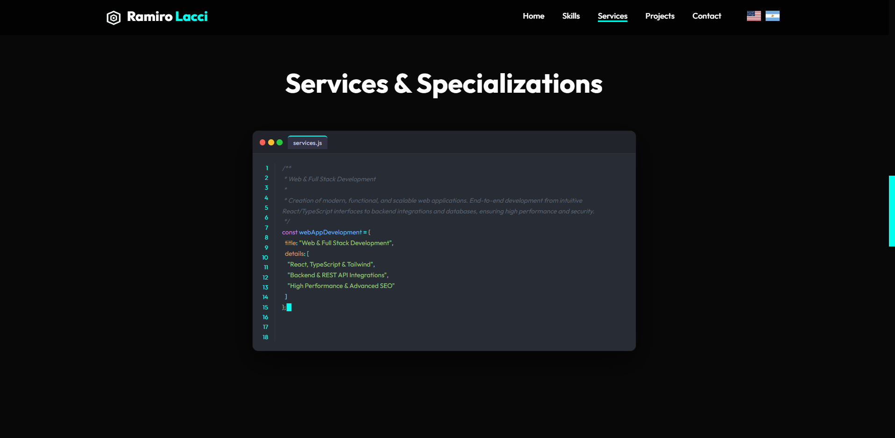
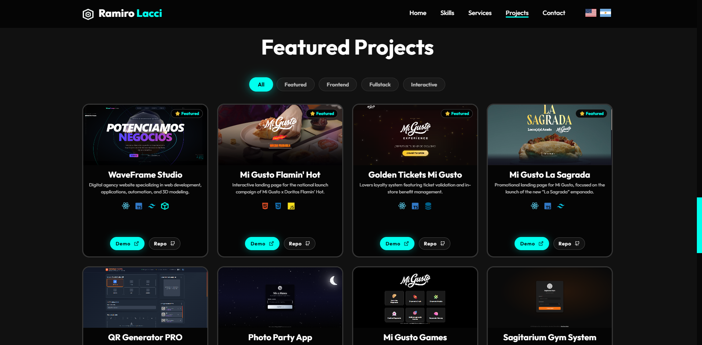
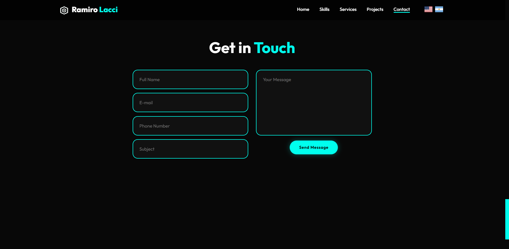

<div align="center">
  
  <h1>Ramiro Lacci | Web Portfolio</h1>
  <p><strong>A modern, high-performance, and visually stunning web architecture showcase.</strong></p>

  <p>
    
    
    
    
    
  </p>
</div>

---

## 🖼️ Project Showcase

<div align="center">

| | |
| :---: | :---: |
|  |  |
| ⚡ *Pantalla Principal — Home Section* | 🛠️ *Habilidades — Skills Timeline* |
|  |  |
| 💻 *Servicios — Code Editor Simulator* | 🚀 *Proyectos — Featured Works* |

<br>


<br>
📬 *Contacto — Get in Touch*

</div>

---

## ✨ Overview

This project is a high-end personal portfolio engineered to demonstrate technical craftsmanship, creative design, and fullstack capabilities. Built with **React 19** and **TypeScript**, it delivers a fluid user experience enhanced by **GSAP** micro-interactions and complete bilingual internationalization.

### 🌟 Key Highlights

- **🌑 Premium Dark Aesthetic**: Custom-curated dark palette with neon accents, glassmorphism, and responsive layout math.
- **🌐 Dual Language Support (ES / EN)**: Full internationalization powered by `react-i18next` with real-time flag switching.
- **🎬 Advanced GSAP Animations**: Smooth entrance animations, scroll-triggered reveals, and interactive cursor states.
- **💻 Interactive Code Simulator**: Custom IDE simulator showcasing live typed code execution for service highlights.
- **📱 Fully Responsive & Fast**: Optimized cross-browser compatibility across desktop, tablet, and mobile devices.
- **📦 Clean Architecture**: Modular component organization, typed constants, and scalable translation catalogs.

---

## 🛠️ Tech Stack

| Category | Technologies Used |
| :--- | :--- |
| **Frontend Framework** | React 19, TypeScript |
| **Build & Tooling** | Vite, pnpm |
| **Animations & FX** | GSAP 3 (ScrollTrigger), Typed.js, Lucide Icons |
| **Localization** | i18next, react-i18next |
| **Icons & Styling** | Boxicons, Lucide React, Vanilla CSS Design System |

---

## 📂 Project Structure

```text
Portfolio/
├── public/
│   ├── images/          # Project & service screenshots
│   ├── logo/            # Developer brand logo assets
│   └── flags/           # Language switcher SVG flags
├── src/
│   ├── components/      # Modular UI components (Hero, Skills, Services, Projects, Contact)
│   ├── constants.ts     # Centralized project data & skills registry
│   ├── i18n.ts          # Internationalization configuration
│   ├── index.css        # Core design system & global styling
│   ├── translations_es.json # Spanish copy catalog
│   └── translations_en.json # English copy catalog
└── README_assets/       # Showcase screenshots for documentation
```

---

## 🚀 Getting Started

To run this repository locally on your machine, follow these steps:

### Prerequisites
- **Node.js**: v18.0.0 or higher
- **pnpm** (or `npm` / `yarn`)

### Installation

1. **Clone the repository**
   ```bash
   git clone https://github.com/ramirolacci/Portfolio.git
   cd Portfolio
   ```

2. **Install dependencies**
   ```bash
   pnpm install
   ```

3. **Start the development server**
   ```bash
   pnpm run dev
   ```

4. **Build for production**
   ```bash
   pnpm run build
   ```

---

## 📬 Contact & Connect

<div align="center">

[](https://www.linkedin.com/in/ramiro-lacci-20386026a/)
[](https://github.com/ramirolacci)
[](https://wa.link/a1bh6y)

<br>

Developed with ❤️ by **Ramiro Lacci**

</div>
